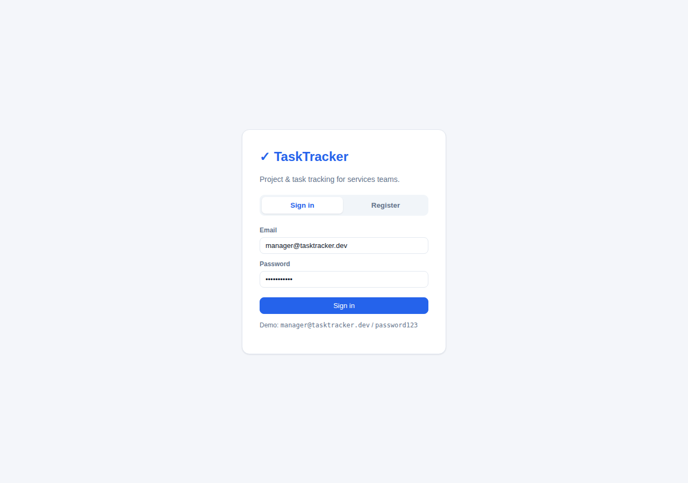
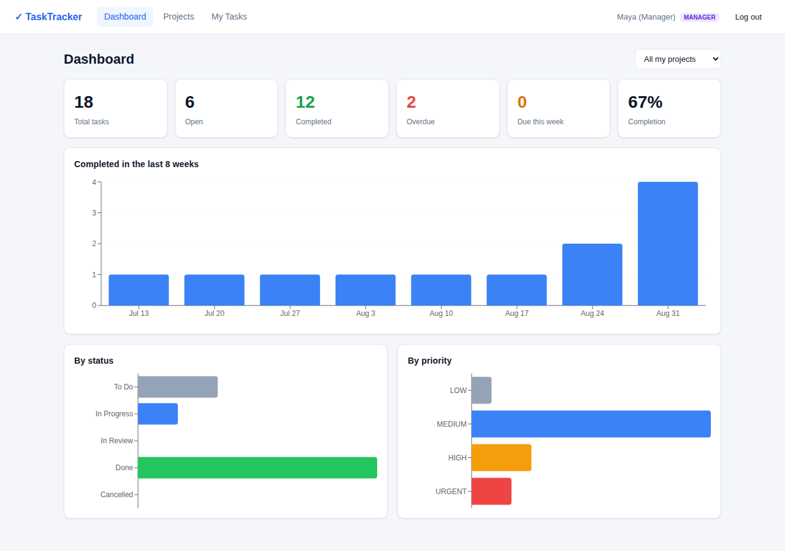
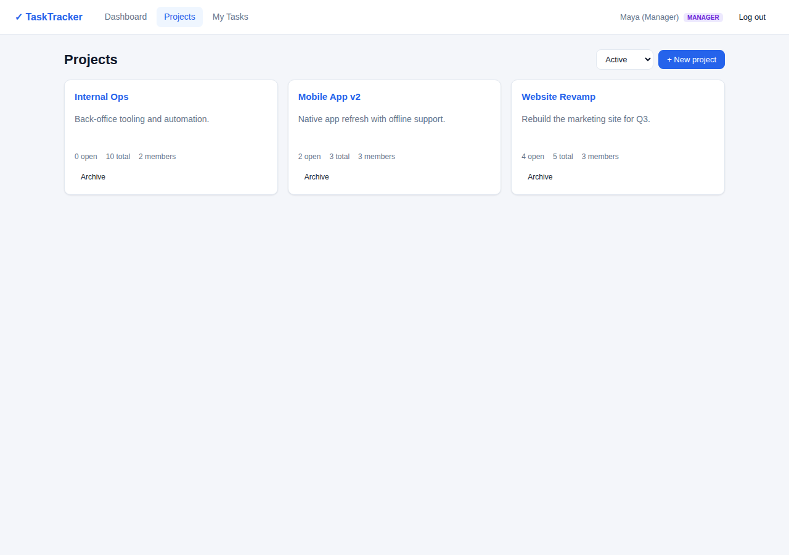
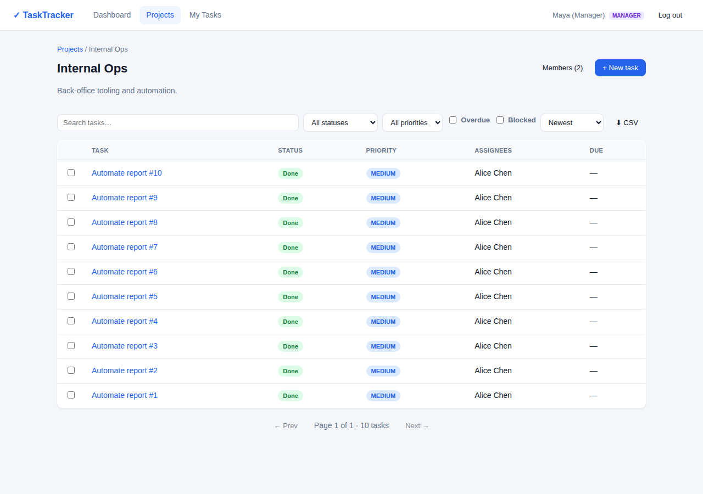
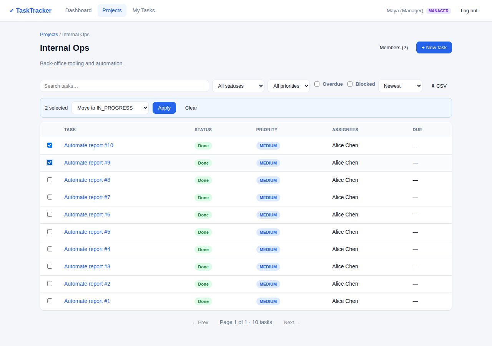
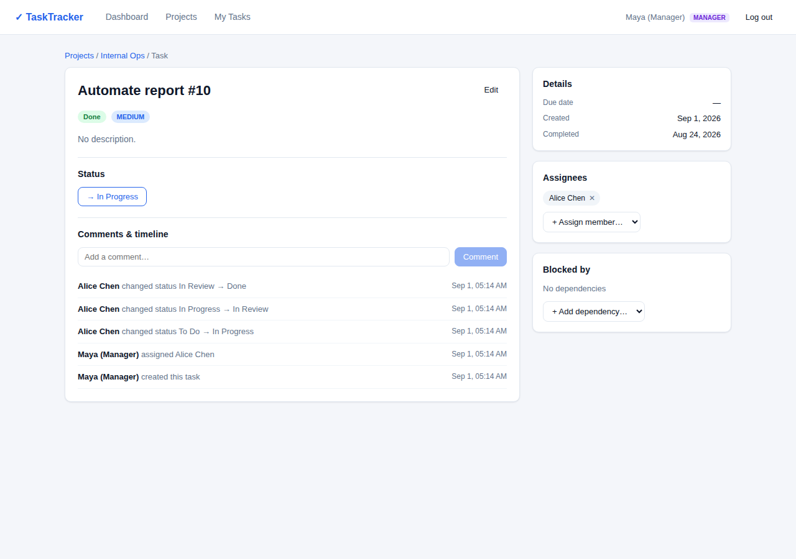
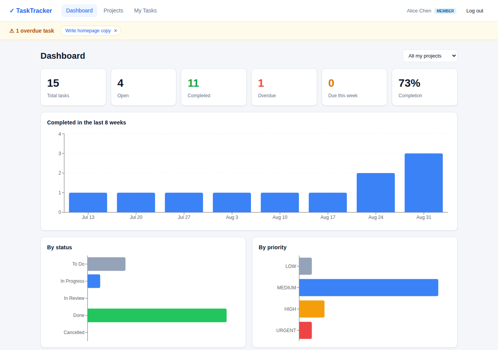
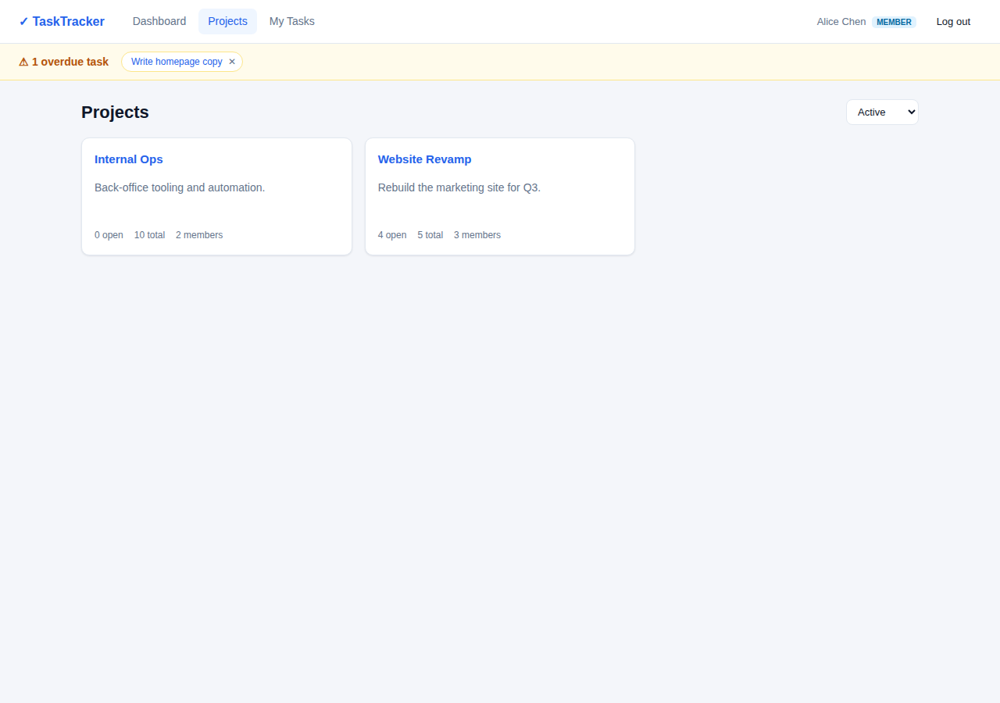
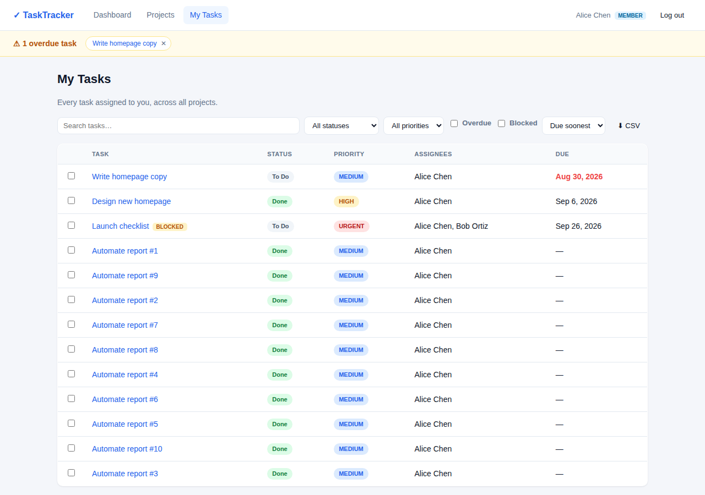

<div align="center">

# ✓ TaskTracker

**A project & task tracking application for services teams** — projects, a strict task lifecycle,
blocking dependencies, multi-assignee work, an activity dashboard, an immutable audit timeline,
and overdue alerts. Full-stack TypeScript, with every rule enforced server-side.

</div>

---

## 🔗 Live demo & login

- **Live app:** https://tasktracker-k6dz.onrender.com
- **Source:** https://github.com/akashnegetive/Task-Tracker

> First load on the free tier can take ~30–60s while the server wakes up.

### Demo accounts

All accounts use the password **`password123`**.

| Role        | Email                       | What they can do                                                        |
|-------------|-----------------------------|------------------------------------------------------------------------|
| **Manager** | `manager@tasktracker.dev`   | Everything: create/edit/archive projects, manage members, all tasks.   |
| Member      | `alice@tasktracker.dev`     | Work within their projects; move only tasks they're assigned to.       |
| Member      | `bob@tasktracker.dev`       | Same as above.                                                          |
| Member      | `carol@tasktracker.dev`     | Same as above.                                                          |

> **Manager vs Member** is the core permission split. A **Manager** oversees *all* projects; a
> **Member** (employee) only sees projects they belong to and can only push their *own* assigned
> tasks through the lifecycle. Every one of these rules is checked on the server — the UI just
> reflects them.

---

## 📸 Screenshots

### Sign in
The landing screen. First registered user becomes a Manager; later sign-ups are Members.



---

### 👔 Manager view

**Dashboard** — headline metrics, an 8-week completion chart, and breakdowns by status and priority.
A Manager sees data across all projects.



**Projects** — every project with open/total task counts and members. Managers get **+ New project**,
plus archive/restore controls.



**Project detail** — the task list with search, status/priority filters, "Overdue"/"Blocked"
toggles, sorting, pagination, **CSV export**, member management, and **+ New task**.



**Bulk actions** — select multiple tasks and apply one operation. The menu only offers **valid**
lifecycle transitions for the current selection (here two `Done` tasks can only be reopened to
`In Progress`), and results are reported per-task.



**Task detail** — priority, due date, assignees, dependencies (blocked-by / blocks), lifecycle
transition buttons, comments, and an **immutable timeline** of every change (who, what, when).



---

### 👩‍💻 Employee (Member) view

**Dashboard** — scoped to the member's own projects only.



**Projects** — a Member sees only the projects they belong to, and has **no** "New project" button
(project management is Manager-only).



**My Tasks + overdue alerts** — every task assigned to them across all projects. The amber banner is
the **overdue alert** (dismissible, and it reappears if the task is rescheduled); note the `BLOCKED`
tag on a task waiting on a dependency, and the overdue due date in red.



---

## ✨ Features

| # | Feature | Details |
|---|---------|---------|
| 1 | **Auth + roles** | Register/login, JWT in an httpOnly cookie, bcrypt hashing. Manager/Member roles with **authorization enforced server-side** on every route. |
| 2 | **Projects & membership** | Create, edit, **archive/restore** (soft — nothing is lost), and add/remove members. |
| 3 | **Tasks & dependencies** | Priority, description, due date, and **blocking dependencies** (same-project, cycle-safe). |
| 4 | **Strict lifecycle** | Server-enforced state machine `TODO → IN_PROGRESS → IN_REVIEW → DONE` (+ `CANCELLED`); can't start/finish a task while a dependency is unresolved; only assignees/managers can transition. |
| 5 | **Multi-assignee + My Tasks** | Assign several people to a task; a cross-project "my tasks" view. |
| 6 | **Search / filter / sort / paginate** | All server-side: text search, status/priority/assignee/overdue/blocked filters, sorting (incl. priority severity), paginated results. |
| 7 | **Bulk operations + CSV** | Apply one operation to many tasks with **per-task success/failure**, plus filtered CSV export. |
| 8 | **Dashboard** | Metrics (total/open/completed/overdue/due-soon), status & priority breakdowns, and an **8-week completion chart**. |
| 9 | **Immutable timeline** | Append-only history of field changes, status transitions, assignments, dependencies and comments — **enforced at the database** (a trigger rejects UPDATE/DELETE). |
| 10 | **Overdue alerts** | Per-user dismissal that **reappears** when a task is rescheduled but still overdue; clears when completed or moved into the future. |

---

## 🔐 Roles & permissions

| Action | Manager | Member |
|---|:---:|:---:|
| See all projects | ✅ | ❌ (only their own) |
| Create / edit / archive a project | ✅ | ❌ |
| Manage project members | ✅ | ❌ |
| Create & edit tasks in their projects | ✅ | ✅ |
| Move a task through the lifecycle | ✅ (any) | ✅ (only if assigned) |
| Comment, view timeline | ✅ | ✅ |
| Bulk operations & CSV export | ✅ | ✅ (their scope) |

---

## 🧱 Tech stack

| Layer     | Choice |
|-----------|--------|
| Frontend  | React + TypeScript (Vite), React Query, React Router, Recharts |
| Backend   | Node.js + Express + TypeScript |
| Database  | PostgreSQL via **Kysely** (typed SQL) + hand-written SQL migrations |
| Auth      | JWT in an httpOnly cookie, bcrypt |
| Tests     | Vitest + Supertest (26 integration tests) |
| Deploy    | Single service — the API also serves the built SPA (same origin) |

---

## 🚀 Run it locally

Prerequisites: **Node 20+** and either Docker (for Postgres) or a Postgres connection string.

```bash
# 1. start Postgres
docker compose up -d

# 2. backend
cd server
cp .env.example .env
npm install
npm run migrate      # apply SQL migrations
npm run seed         # demo users + sample data (resets the DB)
npm run dev          # http://localhost:4000

# 3. frontend (new terminal)
cd client
cp .env.example .env
npm install
npm run dev          # http://localhost:5173
```

Then sign in with any account from the table above.

---

## 🧪 Tests

```bash
cd server
npm test             # 26 integration tests: authz, lifecycle, dependencies, bulk, alerts, dashboard
```

---

## ☁️ Deployment

Deploys as a **single web service** (the API serves the built SPA) plus a managed Postgres.
Step-by-step GitHub + Render instructions are in **[`docs/deploy.md`](docs/deploy.md)**, and a
`render.yaml` blueprint is included.

> After the first deploy, run the seed **once** (`npm run seed`) so the demo accounts exist —
> otherwise login returns "Invalid email or password" against an empty database.

---

## 📁 Project structure

```
task-tracker/
├── client/          # React (Vite) single-page app
│   └── src/
│       ├── api/         # typed API client + React Query hooks
│       ├── components/  # layout, task list, badges, modal, overdue banner
│       └── pages/       # login, projects, project detail, task detail, my tasks, dashboard
├── server/          # Express + Kysely API
│   ├── migrations/      # hand-written SQL (source of the schema)
│   └── src/
│       ├── modules/     # auth, projects, tasks, alerts, dashboard (routes→services)
│       ├── middleware/  # auth, authorization, error handling
│       ├── lib/         # access control, errors, jwt, csv, validation
│       └── db/          # Kysely types, connection, migration runner, seed
├── docs/            # architecture, schema, plan, decisions, ai-prompts, deploy
├── screenshots/     # images used in this README
└── render.yaml      # single-service deploy blueprint
```

---

## 📚 Documentation

- [`docs/architecture.md`](docs/architecture.md) — components, request path, what wasn't built
- [`docs/schema.md`](docs/schema.md) — tables, constraints, denormalization, scaling
- [`docs/decisions.md`](docs/decisions.md) — key technical decisions (incl. one reversed)
- [`docs/plan.md`](docs/plan.md) — build sessions, estimates vs actual, cuts
- [`docs/ai-prompts.md`](docs/ai-prompts.md) — AI usage log, including wrong turns
- [`docs/deploy.md`](docs/deploy.md) — deployment walkthrough
- [`SUBMISSION.md`](SUBMISSION.md) — goal checklist, credentials, time spent
